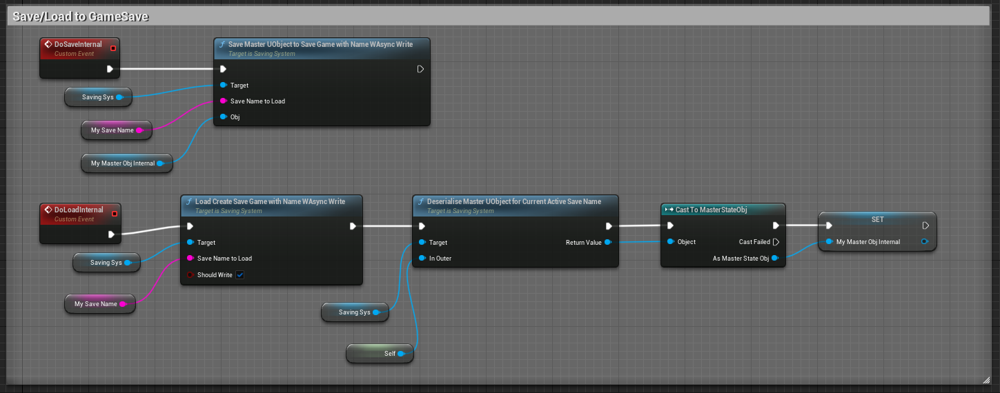

# Saving/Loading System (with Serialisation) Example
This is a complete example project (UE 5.1) on how to do serialisation for UObjects and Actors (not tested). The project is based on the TopDownThirdPersonTemplate included with Unreal. 

This example is the result of me asking a [Question](https://forums.unrealengine.com/t/should-i-clear-arrays-of-pointers-before-saving-struct-to-gamesave/751456/13) in the Unreal Forum regarding problems getting the Saving/Loading [Example](https://unrealcommunity.wiki/savegame-pointers-and-structs-8wlg0qms) in the Unreal Legacy Wiki to work from the `GameInstance`. 

[Chatouille](https://dev.epicgames.com/community/profile/WoQ9/Chatouille) helped with identifying the problem but highlighted the limitations of the approach. He kindly pointed me to his [serialisation approach](https://dev.epicgames.com/community/snippets/Ele/unreal-engine-runtime-uobject-serialization) which I have used to write this example. 

### Supported types
1. UObjects and its properties
2. Actors (not tested) and its properties
3. Arrays of pointers to UObjects/Actors
4. Pointers to other UObjects/Actors
5. Subuobjects

# Implemented Features
Chatouille's implementation serialises a `UObject` (and its subobjects) to a file that is written to disk. I have wrapped his code into a `static` Blueprint library. Additionally, I wrote a `SavingSystem` class that can make use of the functions to serialise the top `UObject` (and subobjects) to a `TArray<uint8>` inside a `USaveGame` file. There is also a function to serialise it externally but keep a record inside the `USaveGame`. This also makes it possible to easily open other save file's serialised objects. 

# Not Implemented Feature

The `Async` event hasn't been implemented correctly. I may add it later on, but for now it's not functional. 

# *Tagging Properties correctly*
Make sure you tag what you want to be serialised with 
`UPROPERTY(SaveGame)`. Obviously, other properties can also be used. 

# NOTE when Deserialising UObjects

The `InOuter` passed to 
`DeserializeUObjectFromByteArray(TArray<uint8>& AllBytes, UObject* InOuter)` must be a `WorldActor` when deserialising another Actor. As far as I know, this is necessary for Unreal to spawn Actors in the world. I have only tested deserialising `UObjects` from the `GameInstance`. 

---

# Example use of the features implemented

## Load/Save Serialised File linked to currently opened GameSave

## Load Serialised File linked to another GameSave

## Load/Save Serialised File save inside current GameSave

## Load/Save Serialised File NO GameSave

# Bugs, more features, etc. 
Happy to take on changes/improvements, etc. Please submit any additions. 

# Disclaimer
This code is provided as IS for example purposes. There are no warranties of any kind. It has not been tested thoroughly. 